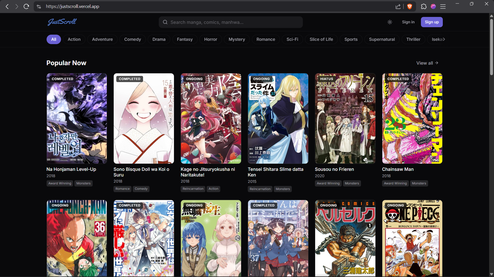
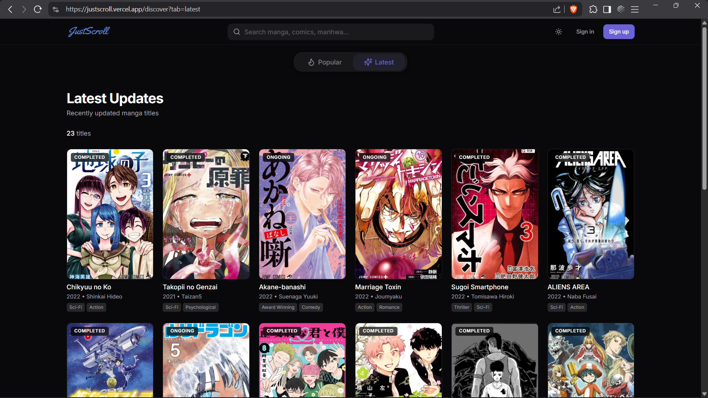
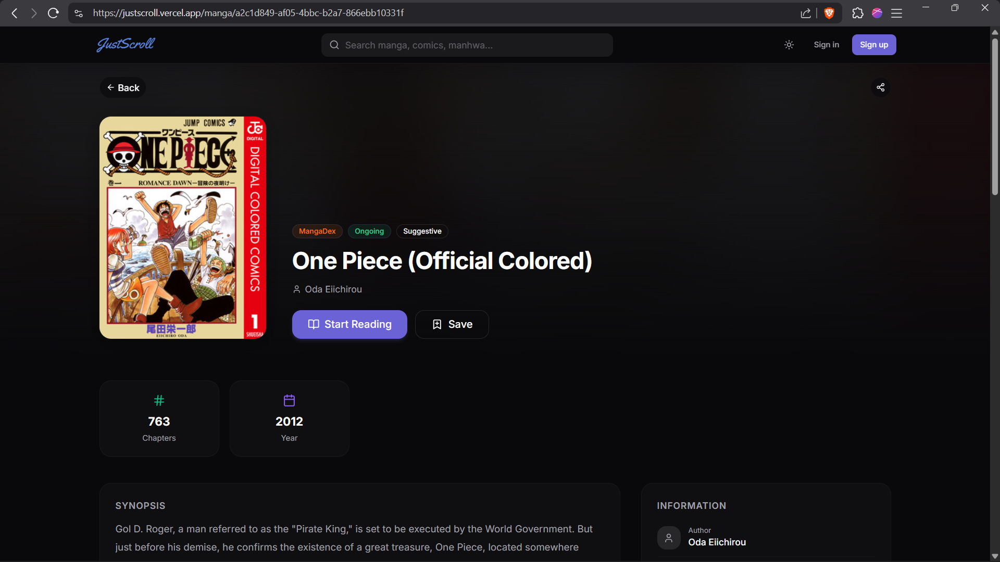
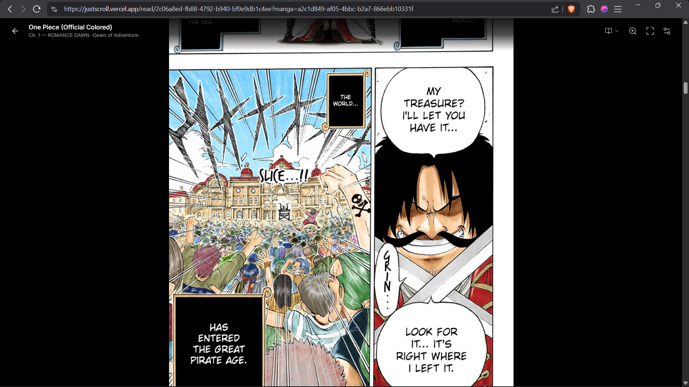
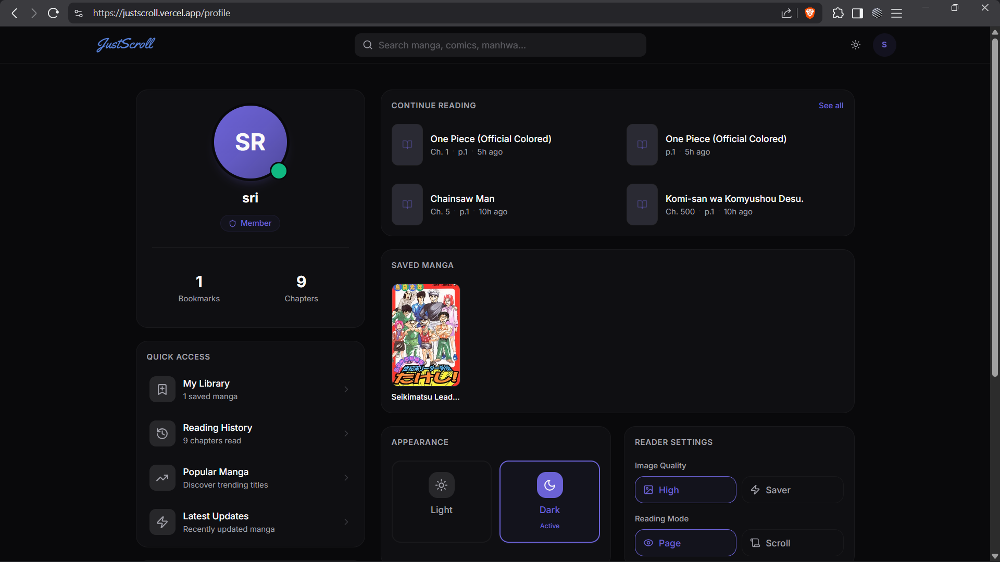
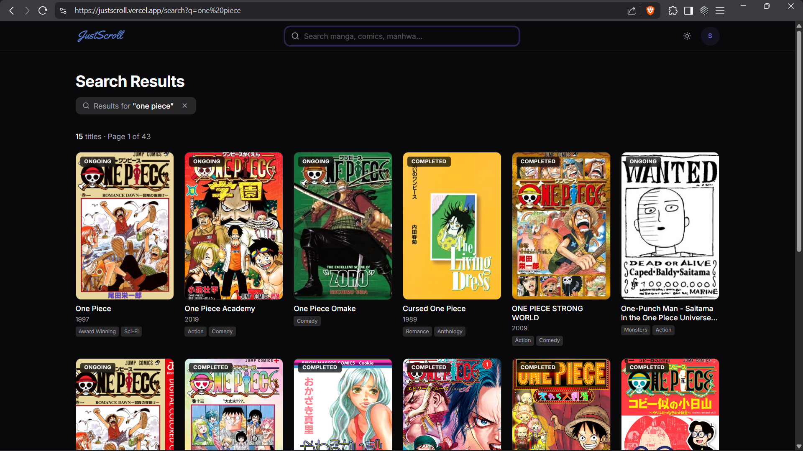
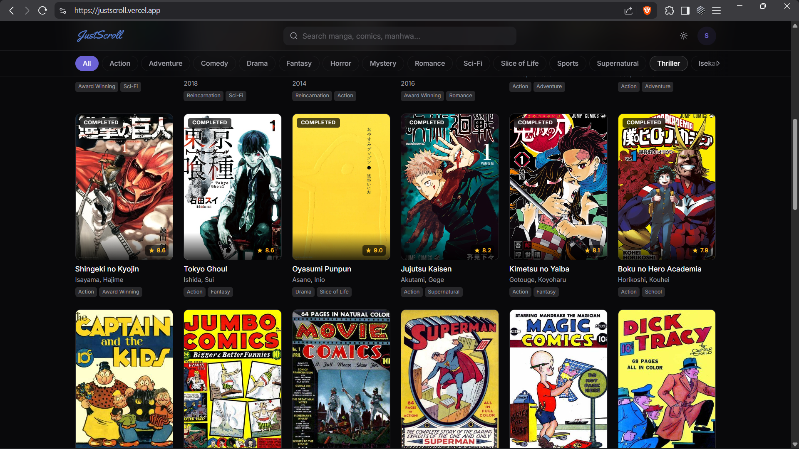
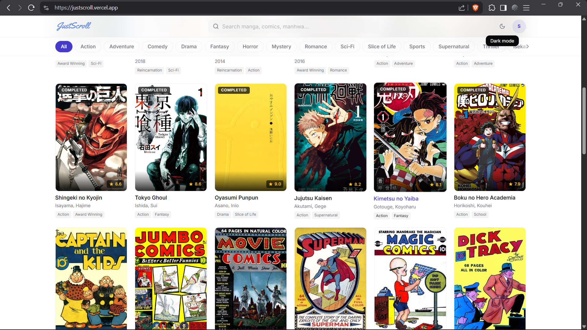

<div align="center">


<br />

# ✦ JustScroll Mobile

**A premium manga reading experience**

Discover, read, and track your favorite manga, manhwa & comics — beautifully.

<br />


<br />

[Features](#-features) · [Screenshots](#-screenshots) · [Quick Start](#-quick-start) · [Architecture](#-architecture) · [API](#-api-integration)

<br />

<a href="https://justscroll.vercel.app">
  
</a>

<br />

---

</div>


## ◆ Screenshots

### Desktop

<table>
<tr>
<td width="50%">

<p align="center"><strong>Home</strong> — Genre toolbar with Popular & Latest sections</p>
</td>
<td width="50%">

<p align="center"><strong>Discover</strong> — Tabbed browsing with pagination</p>
</td>
</tr>
<tr>
<td width="50%">

<p align="center"><strong>Manga Detail</strong> — Hero, stats, chapters & characters</p>
</td>
<td width="50%">

<p align="center"><strong>Reader</strong> — Fullscreen with settings panel</p>
</td>
</tr>
<tr>
<td width="50%">

<p align="center"><strong>Profile</strong> — Dashboard with settings & stats</p>
</td>
<td width="50%">

<p align="center"><strong>Search</strong> — Full-text search with results grid</p>
</td>
</tr>
</table>

### Mobile

<table>
<tr>
<td width="25%">

<p align="center"><strong>Home</strong></p>
</td>
<td width="25%">

<p align="center"><strong>Manga Detail</strong></p>
</td>
<td width="25%">

<p align="center"><strong>Reader</strong></p>
</td>
<td width="25%">

<p align="center"><strong>Profile</strong></p>
</td>
</tr>
</table>

### Themes

<table>
<tr>
<td width="50%">

<p align="center"><strong>Dark Mode</strong></p>
</td>
<td width="50%">

<p align="center"><strong>Light Mode</strong></p>
</td>
</tr>
</table>

<br />

## ◆ Features

<table>
<tr>
<td width="50%">

### 🔍 Discover & Browse
- Popular & latest manga feeds
- 25+ genre filters with horizontal scroll toolbar
- Full-text search with paginated results
- Deduplicated results across sources

</td>
<td width="50%">

### 📖 Chapter Reader
- Single page & continuous long strip modes
- Left-to-right / Right-to-left direction
- Pinch zoom with reset
- Keyboard navigation & fullscreen
- Auto-hiding toolbar with scroll detection
- Chapter selector & progress bar

</td>
</tr>
<tr>
<td width="50%">

### 📚 Manga Detail
- Hero banner with blurred cover backdrop
- Score, members, chapters, year stats
- Expandable synopsis
- Searchable & sortable chapter list
- Character grid with role badges
- Share sheet (Twitter, WhatsApp, Telegram, etc.)

</td>
<td width="50%">

### 👤 User System
- JWT auth with automatic token refresh
- Bookmarks library with cover grid
- Reading history with chapter resume
- Profile dashboard with stats
- Reader & appearance settings
- Protected routes with redirect

</td>
</tr>
<tr>
<td width="50%">

### 🎨 Design System
- Light & dark themes with system detection
- CSS custom properties for all colors
- Glassmorphism navigation
- Consistent spacing & typography
- Smooth page transitions via Framer Motion

</td>
<td width="50%">

### 📱 Responsive
- Mobile-first approach
- Floating bottom navigation with animated pill
- Touch-optimized tap zones in reader
- Safe area support for notched devices
- Desktop sidebar TOC on legal pages
- Adaptive grid layouts (2→6 columns)

</td>
</tr>
</table>

<br />

## ◆ Tech Stack

| Layer | Technology | Purpose |
|:------|:-----------|:--------|
| **Framework** | React 18 | Component architecture with lazy loading |
| **Build** | Vite 6 | Fast HMR, ESM-based bundling |
| **Styling** | Tailwind CSS 3 | Utility-first with custom design tokens |
| **Routing** | React Router v6 | File-based route structure |
| **Server State** | TanStack React Query | Caching, background refetch, pagination |
| **Client State** | Zustand | Lightweight stores for auth, theme, reader, toasts |
| **Animations** | Framer Motion | Layout animations, page transitions, gestures |
| **Icons** | Lucide React | 1000+ consistent stroke icons |
| **UI Primitives** | Radix UI | Accessible dropdown, dialog, tabs, tooltip, scroll area |

<br />

## ◆ Quick Start

### Prerequisites

```
Node.js ≥ 18
npm or yarn
```

### Install & Run

```bash
# Navigate to web frontend
cd web

# Install dependencies
npm install

# Create environment file
echo "VITE_API_URL=http://localhost:8000" > .env

# Start development server
npm run dev
```

App opens at **`http://localhost:5173`**

### Build for Production

```bash
npm run build     # Output → dist/
npm run preview   # Preview production build
```

### Production

Live at **[justscroll.vercel.app](https://justscroll.vercel.app)**

<br />

## ◆ Architecture

### State Management

```
┌─────────────────────────────────────────────┐
│                  Component                  │
├──────────────┬──────────────────────────────┤
│              │                              │
│   useQuery   │        useAuthStore          │
│   (server)   │     useReaderStore           │
│              │     useThemeStore            │
│              │     useToastStore            │
│              │        (client)              │
├──────────────┼──────────────────────────────┤
│              │                              │
│   api.js ────┤──── localStorage             │
│   (fetch)    │   (tokens, preferences)      │
│              │                              │
├──────────────┴──────────────────────────────┤
│             Backend API / CDN               │
└─────────────────────────────────────────────┘
```

| Store | Data | Persistence |
|:------|:-----|:------------|
| `authStore` | User object, JWT tokens, auth state | `localStorage` |
| `readerStore` | Quality, mode, current page, UI toggle | `localStorage` |
| `themeStore` | Light / dark theme | `localStorage` |
| `toastStore` | Active toast notifications | Memory only |

### Data Fetching Strategy

| Data Type | Method | Cache Time | Stale Time |
|:----------|:-------|:-----------|:-----------|
| Popular manga | `useQuery` | 10 min | 5 min |
| Latest updates | `useQuery` | 10 min | 3 min |
| Search results | `useQuery` | 5 min | 3 min |
| Manga detail | `useQuery` | — | 10 min |
| Chapter pages | `useQuery` | — | 10 min |
| Characters | `useQuery` | — | 60 min |
| Bookmarks | `useQuery` | — | 30 sec |
| History | `useQuery` | — | 30 sec |

### Image Pipeline

```
Third-party CDN
       ↓
Backend Proxy  (/api/v1/proxy/image?url=...)
       ↓
OptimizedImage component
  • IntersectionObserver (lazy load at 200px margin)
  • Loading skeleton → fade-in transition
  • Error fallback with icon
```

### Authentication Flow

```
Register/Login
     ↓
Backend returns { access_token, refresh_token }
     ↓
Stored in localStorage
     ↓
api.js attaches Bearer token to auth requests
     ↓
On 401 → auto-refresh using refresh_token
     ↓
If refresh fails → clear tokens, redirect to /login
```

<br />

## ◆ API Integration

All API calls go through `src/lib/api.js`:

| Method | Endpoint | Auth | Description |
|:-------|:---------|:----:|:------------|
| `POST` | `/api/v1/auth/register` | — | Create account |
| `POST` | `/api/v1/auth/login` | — | Sign in |
| `POST` | `/api/v1/auth/refresh` | — | Refresh tokens |
| `GET` | `/api/v1/manga/search?q=` | — | Search manga |
| `GET` | `/api/v1/manga/popular` | — | Popular titles |
| `GET` | `/api/v1/manga/latest-updates` | — | Latest updates |
| `GET` | `/api/v1/manga/:id` | — | Manga detail |
| `GET` | `/api/v1/manga/:id/chapters` | — | Chapter list |
| `GET` | `/api/v1/manga/:id/characters` | — | Characters |
| `GET` | `/api/v1/chapters/:id/pages` | — | Chapter pages |
| `GET` | `/api/v1/user/bookmarks` | ✓ | Get bookmarks |
| `POST` | `/api/v1/user/bookmarks/:id` | ✓ | Add bookmark |
| `DELETE` | `/api/v1/user/bookmarks/:id` | ✓ | Remove bookmark |
| `GET` | `/api/v1/user/history` | ✓ | Reading history |
| `POST` | `/api/v1/user/history` | ✓ | Update progress |
| `GET` | `/api/v1/proxy/image?url=` | — | Proxy image |

See [`backend/README.md`](../backend/README.md) for full API documentation.

<br />

## ◆ Design System

### Color Tokens

All colors use HSL CSS custom properties for seamless light/dark switching:

```css
--background       --foreground
--card             --card-foreground
--primary          --primary-foreground
--secondary        --secondary-foreground
--muted            --muted-foreground
--accent           --accent-foreground
--destructive      --destructive-foreground
--border           --input            --ring
```

### Typography

| Usage | Font | Weight |
|:------|:-----|:-------|
| UI text | Inter | 300–900 |
| Code / mono | JetBrains Mono | 400–500 |

### Component Variants

| Component | Variants |
|:----------|:---------|
| Button | `primary` `secondary` `outline` `ghost` `destructive` `link` |
| Badge | `default` `secondary` `success` `warning` `destructive` `outline` |
| Input | Standard, with icon, password toggle, error state |
| Skeleton | Card, grid, detail, reader |

<br />

## ◆ Browser Support

| Browser | Minimum Version |
|:--------|:----------------|
| Chrome / Edge | 90+ |
| Firefox | 90+ |
| Safari | 15+ |
| Mobile Safari | 15+ |
| Chrome Android | 90+ |

<br />

## ◆ Scripts

| Command | Description |
|:--------|:------------|
| `npm run dev` | Start Vite dev server with HMR |
| `npm run build` | Production build to `dist/` |
| `npm run preview` | Serve production build locally |

<br />

## ◆ Data Sources

Content is aggregated from third-party APIs. JustScroll does not host any manga content.

| Source | Data Provided |
|:-------|:-------------|
| [MangaDex](https://mangadex.org) | Manga metadata, chapters, pages |
| [Jikan](https://jikan.moe) | MyAnimeList scores, members, characters |
| [ComicVine](https://comicvine.gamespot.com) | Comic metadata |

<br />

---
<div align="center">

**Part of the [JustScroll](../README.md) platform**

Made with React, Tailwind & lots of manga.

</div>